# 🏨 HostelMate — Complete System Architecture, Database Schema & Operational Flow Blueprint

> **Document Version:** 1.0.0  
> **Target System:** HostelMate (College Hostel Management & Resident Community Platform)  
> **Framework & Stack:** Python 3 / Django 6.1.1 / SQLite (Dev) / PostgreSQL (Production) / Django MVT Templates / Vanilla JavaScript & CSS  
> **Author:** Antigravity Engineering Architecture  
> **Last Updated:** 2026-10-06  

---

## 📑 Table of Contents

1. [Executive Summary & System Vision](#1-executive-summary--system-vision)
2. [High-Level System Architecture](#2-high-level-system-architecture)
   - 2.1 [Architecture Overview (Tiered MVT Model)](#21-architecture-overview-tiered-mvt-model)
   - 2.2 [System Component & Request Lifecycle Diagram](#22-system-component--request-lifecycle-diagram)
   - 2.3 [Role-Based Access Control (RBAC) Matrix](#23-role-based-access-control-rbac-matrix)
3. [Complete Database Architecture & Schema Design](#3-complete-database-architecture--schema-design)
   - 3.1 [Entity Relationship (ER) Diagram](#31-entity-relationship-er-diagram)
   - 3.2 [Comprehensive Table & Field Dictionary](#32-comprehensive-table--field-dictionary)
   - 3.3 [Database Constraints, Indexes & Integrity Rules](#33-database-constraints-indexes--integrity-rules)
4. [Implemented End-to-End User & System Flows](#4-implemented-end-to-end-user--system-flows)
   - 4.1 [User Authentication & Profile Provisioning Flow](#41-user-authentication--profile-provisioning-flow)
   - 4.2 [Dual Dashboard & Role Dispatch Flow](#42-dual-dashboard--role-dispatch-flow)
   - 4.3 [Complaint & Maintenance Ticket Lifecycle Flow](#43-complaint--maintenance-ticket-lifecycle-flow)
   - 4.4 [Mess Schedule & Food Quality Feedback Flow](#44-mess-schedule--food-quality-feedback-flow)
   - 4.5 [Peer Resource & Study Material Sharing Flow](#45-peer-resource--study-material-sharing-flow)
   - 4.6 [Lost & Found Incident Tracking Flow](#46-lost--found-incident-tracking-flow)
   - 4.7 [Admin Student & Room Roster Management Flow](#47-admin-student--room-roster-management-flow)
5. [The Remaining Flows (Production & Enterprise Expansion Roadmap)](#5-the-remaining-flows-production--enterprise-expansion-roadmap)
   - 5.1 [Flow A: Digital Outpass & Gate Pass Management System](#51-flow-a-digital-outpass--gate-pass-management-system)
   - 5.2 [Flow B: Automated Room Allocation & Bed Matrix System](#52-flow-b-automated-room-allocation--bed-matrix-system)
   - 5.3 [Flow C: Fee Ledger & Online Payment Gateway Flow](#53-flow-c-fee-ledger--online-payment-gateway-flow)
   - 5.4 [Flow D: Real-Time Notification & Emergency Broadcast Engine](#54-flow-d-real-time-notification--emergency-broadcast-engine)
   - 5.5 [Flow E: Resident Night Roll-Call & Attendance Tracking Flow](#55-flow-e-resident-night-roll-call--attendance-tracking-flow)
   - 5.6 [Flow F: Maintenance Staff / Technician Work Order Dispatch Flow](#56-flow-f-maintenance-staff--technician-work-order-dispatch-flow)
   - 5.7 [Flow G: Visitor & Guest Room Reservation Flow](#57-flow-g-visitor--guest-room-reservation-flow)
   - 5.8 [Flow H: Automated Reporting & SLA Analytics Flow](#58-flow-h-automated-reporting--sla-analytics-flow)
6. [API Endpoints Specification](#6-api-endpoints-specification)
7. [Security, Scalability & Production Deployment Architecture](#7-security-scalability--production-deployment-architecture)

---

## 1. Executive Summary & System Vision

**HostelMate** is an all-in-one digital hostel ecosystem designed to bridge the operational gap between **Hostel Residents (Students)** and **Hostel Administration (Wardens, Caretakers, and Facility Managers)**.

### Primary Problem Solved:
Traditional campus hostels rely on fragmented physical registers, verbal complaints, paper notices, and unstructured WhatsApp groups. This causes:
- Lost or untracked maintenance issues (plumbing, electricity, Wi-Fi).
- Poor transparency in mess menu schedules and food quality accountability.
- Chaos in lost and found belongings and underutilized student resources.
- Inefficient student registry and room records.

### Solution Overview:
HostelMate consolidates all daily hostel operations into a responsive, secure web platform featuring:
- **Instant Maintenance Ticketing**: Real-time complaint submission with priority and lifecycle statuses (`pending`, `in_progress`, `resolved`, `rejected`).
- **Mess Quality & Meal Planning**: Day-wise live meal schedules with transparent student star ratings and feedback.
- **Hostel Community Sharing**: Peer-to-peer textbook, electronics, and sports equipment lending.
- **Lost & Found Board**: Searchable, status-tracked item recovery channel.
- **Admin Control Center**: Live metrics dashboard, student directory filtering, room reassignment, and broadcast announcements.

---

## 2. High-Level System Architecture

### 2.1 Architecture Overview (Tiered MVT Model)

HostelMate is built upon Django's robust **Model-View-Template (MVT)** architectural paradigm, structured into clean horizontal layers:

```
┌─────────────────────────────────────────────────────────────────────────────┐
│                             CLIENT LAYER (BROWSER)                          │
│   • Responsive HTML5 / CSS3 / JavaScript (Vanilla)                          │
│   • Semantic Web Pages & Interactive Modals / Filter Controls              │
└──────────────────────────────────────┬──────────────────────────────────────┘
                                       │ HTTP(S) Requests (GET / POST)
                                       ▼
┌─────────────────────────────────────────────────────────────────────────────┐
│                           SECURITY & MIDDLEWARE LAYER                       │
│   • SecurityMiddleware (SSL / HSTS)       • SessionMiddleware               │
│   • CsrfViewMiddleware (CSRF Protection)  • AuthenticationMiddleware        │
│   • MessageMiddleware (Flash feedback)    • XFrameOptionsMiddleware         │
└──────────────────────────────────────┬──────────────────────────────────────┘
                                       │
                                       ▼
┌─────────────────────────────────────────────────────────────────────────────┐
│                           ROUTING & CONTROLLER LAYER                        │
│   • URL Dispatcher (`hostelmate/urls.py` ➔ `core/urls.py`)                  │
│   • View Functions / Controllers (`core/views.py`)                          │
│   • Django Form Validation (`core/forms.py`)                                │
│   • Role-Based Access Control Guards (`@login_required`, `profile.is_admin`)│
└───────────────────┬─────────────────────────────────────┬───────────────────┘
                    │ Reads / Writes                      │ Injects Context
                    ▼                                     ▼
┌──────────────────────────────────────┐  ┌───────────────────────────────────┐
│         DATA PERSISTENCE LAYER       │  │        PRESENTATION LAYER         │
│   • Django ORM (`core/models.py`)    │  │   • Base Layout (`base.html`)     │
│   • SQLite (Dev) / PostgreSQL (Prod) │  │   • Core Template Modules (13+)   │
│   • Transactions & Relational Keys   │  │   • Template Tags & Filters       │
└──────────────────────────────────────┘  └───────────────────────────────────┘
```

---

### 2.2 System Component & Request Lifecycle Diagram

The sequence below illustrates how an incoming user request traverses HostelMate's layers:

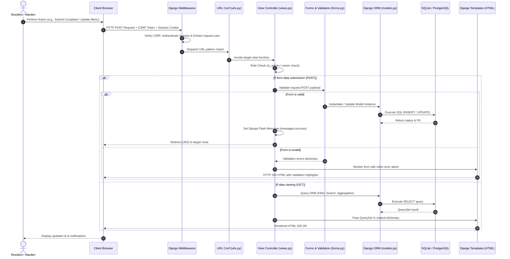

---

### 2.3 Role-Based Access Control (RBAC) Matrix

| Resource / Capability | Anonymous Guest | Student Resident | Warden / Hostel Admin | Superuser / System Admin |
| :--- | :---: | :---: | :---: | :---: |
| **View Login & Register Pages** | ✅ | ❌ (Redirected to Dash) | ❌ (Redirected to Dash) | ❌ (Redirected to Dash) |
| **Self Registration** | ✅ | ❌ | ❌ | ❌ |
| **Student Dashboard Overview** | ❌ | ✅ | ❌ (Sees Admin Dash) | ❌ (Sees Admin Dash) |
| **Admin Analytics Dashboard** | ❌ | ❌ | ✅ | ✅ |
| **View Announcements** | ❌ | ✅ (Read-only) | ✅ (Read-only) | ✅ (Read-only) |
| **Create / Delete Announcements** | ❌ | ❌ | ✅ | ✅ |
| **File Complaint** | ❌ | ✅ (For self room) | ✅ | ✅ |
| **View My Complaints** | ❌ | ✅ (Only own tickets) | ✅ (All hostel tickets) | ✅ (All hostel tickets) |
| **Update Complaint Status & Remarks**| ❌ | ❌ | ✅ | ✅ |
| **View Daily Mess Menu** | ❌ | ✅ | ✅ | ✅ |
| **Edit Mess Menu Schedule** | ❌ | ❌ | ✅ | ✅ |
| **Submit Mess Rating & Review** | ❌ | ✅ | ✅ | ✅ |
| **Post Shared Resource** | ❌ | ✅ | ✅ | ✅ |
| **Toggle Availability of Resource** | ❌ | ✅ (Only own resource) | ✅ (Any resource) | ✅ (Any resource) |
| **Delete Shared Resource** | ❌ | ✅ (Only own resource) | ✅ (Any resource) | ✅ (Any resource) |
| **Report Lost or Found Item** | ❌ | ✅ | ✅ | ✅ |
| **Resolve / Delete Lost & Found** | ❌ | ✅ (Only own report) | ✅ (Any report) | ✅ (Any report) |
| **View Student Directory** | ❌ | ❌ | ✅ | ✅ |
| **Edit Student Room & Block Records** | ❌ | ❌ | ✅ | ✅ |
| **Access Django Admin (`/admin`)** | ❌ | ❌ | ❌ (Staff only) | ✅ |

---

## 3. Complete Database Architecture & Schema Design

### 3.1 Entity Relationship (ER) Diagram

```mermaid
erDiagram
    AUTH_USER ||--|| USER_PROFILE : "has profile (1:1)"
    AUTH_USER ||--o{ ANNOUNCEMENT : "creates (1:N)"
    AUTH_USER ||--o{ COMPLAINT : "files (1:N)"
    AUTH_USER ||--o{ MESS_REVIEW : "submits (1:N)"
    AUTH_USER ||--o{ RESOURCE : "shares (1:N)"
    AUTH_USER ||--o{ LOST_AND_FOUND : "reports (1:N)"

    AUTH_USER {
        int id PK
        string username UK
        string password
        string email
        string first_name
        string last_name
        boolean is_active
        boolean is_staff
        boolean is_superuser
        datetime date_joined
    }

    USER_PROFILE {
        int id PK
        int user_id FK,UK "OneToOne -> AUTH_USER.id"
        string role "student | admin"
        string roll_number "e.g. 2026CS101"
        string room_number "e.g. 302"
        string hostel_block "e.g. Block A"
        string phone "+91 xxxxxxxxxx"
        string emergency_contact
        text bio
    }

    ANNOUNCEMENT {
        int id PK
        string title
        text content
        string category "general | urgent | maintenance | event"
        boolean is_pinned
        int created_by_id FK "ManyToOne -> AUTH_USER.id"
        datetime created_at
        datetime updated_at
    }

    COMPLAINT {
        int id PK
        int student_id FK "ManyToOne -> AUTH_USER.id"
        string title
        string category "electrical | plumbing | cleanliness | wifi | furniture | other"
        string priority "low | medium | high"
        string status "pending | in_progress | resolved | rejected"
        string room_number
        string hostel_block
        text description
        text admin_remarks
        datetime created_at
        datetime updated_at
    }

    MESS_MENU {
        int id PK
        string day "Monday ... Sunday"
        string meal_type "breakfast | lunch | snacks | dinner"
        text items "Menu food items"
        string timing "e.g. 7:30 AM - 9:30 AM"
    }

    MESS_REVIEW {
        int id PK
        int student_id FK "ManyToOne -> AUTH_USER.id"
        int rating "1 to 5 Stars"
        string meal_type "breakfast | lunch | snacks | dinner | general"
        text comments
        datetime created_at
    }

    RESOURCE {
        int id PK
        string title
        string category "book | electronics | sports | lab | other"
        text description
        string contact_info
        int uploader_id FK "ManyToOne -> AUTH_USER.id"
        boolean is_available
        datetime created_at
    }

    LOST_AND_FOUND {
        int id PK
        string item_type "lost | found"
        string title
        string category
        text description
        string location
        date date_event
        string contact_info
        string status "open | resolved"
        int reported_by_id FK "ManyToOne -> AUTH_USER.id"
        datetime created_at
    }
```

---

### 3.2 Comprehensive Table & Field Dictionary

#### 1. `auth_user` (Django Core Auth Table)
- **Primary Key:** `id` (Integer, Auto-increment)
- **Key Columns:** `username` (VARCHAR 150, Unique), `password` (VARCHAR 128, Hashed), `email` (VARCHAR 254), `first_name` (VARCHAR 150), `last_name` (VARCHAR 150), `is_staff` (Boolean), `is_superuser` (Boolean), `is_active` (Boolean).

#### 2. `core_userprofile` (`UserProfile` Model)
Extends Django's user table with hostel-specific resident and administrative attributes.
| Field Name | Type | Null / Blank | Default | Description / Choices |
| :--- | :--- | :---: | :---: | :--- |
| `id` | BigAutoField | No | PK | Internal unique identifier |
| `user_id` | OneToOneField (User) | No | - | Foreign Key to `auth_user.id` (`on_delete=CASCADE`) |
| `role` | CharField(10) | No | `'student'` | `[('student', 'Student'), ('admin', 'Hostel Admin / Warden')]` |
| `roll_number` | CharField(20) | Yes / Yes | `NULL` | College Roll / Enrollment Number |
| `room_number` | CharField(20) | Yes / Yes | `NULL` | Assigned Hostel Room Number (e.g. `304`) |
| `hostel_block`| CharField(50) | Yes / Yes | `'Block A'`| Assigned Block / Wing (e.g. `Block A`, `Block B`) |
| `phone` | CharField(15) | Yes / Yes | `NULL` | Contact Phone Number |
| `emergency_contact` | CharField(15) | Yes / Yes | `NULL` | Guardian / Emergency Phone |
| `bio` | TextField | Yes / Yes | `NULL` | Short personal bio or notes |

#### 3. `core_announcement` (`Announcement` Model)
Official broadcast notices posted by Wardens and Hostel Management.
| Field Name | Type | Null / Blank | Default | Description / Choices |
| :--- | :--- | :---: | :---: | :--- |
| `id` | BigAutoField | No | PK | Announcement ID |
| `title` | CharField(200) | No / No | - | Headline of announcement |
| `content` | TextField | No / No | - | Full markdown / text body of the notice |
| `category` | CharField(20) | No / No | `'general'`| `[('general', 'General Notice'), ('urgent', 'Urgent / Important'), ('maintenance', 'Maintenance Work'), ('event', 'Hostel Event')]` |
| `is_pinned` | BooleanField | No / No | `False` | Pinned notices remain fixed at the top of feeds |
| `created_by_id` | ForeignKey (User)| No / No | - | FK to `auth_user.id` (`on_delete=CASCADE`) |
| `created_at` | DateTimeField | No | `auto_now_add` | Creation timestamp |
| `updated_at` | DateTimeField | No | `auto_now` | Last edit timestamp |

#### 4. `core_complaint` (`Complaint` Model)
Maintenance tickets filed by residents and tracked through resolution.
| Field Name | Type | Null / Blank | Default | Description / Choices |
| :--- | :--- | :---: | :---: | :--- |
| `id` | BigAutoField | No | PK | Ticket Tracking Number |
| `student_id` | ForeignKey (User)| No / No | - | FK to `auth_user.id` (Complainant) |
| `title` | CharField(200) | No / No | - | Brief title of issue (e.g., "Geyser not working") |
| `category` | CharField(20) | No / No | - | `['electrical', 'plumbing', 'cleanliness', 'wifi', 'furniture', 'other']` |
| `description` | TextField | No / No | - | Detailed description of the problem |
| `room_number` | CharField(20) | No / No | - | Room location of the issue |
| `hostel_block`| CharField(50) | No / No | `'Block A'`| Hostel block where issue is present |
| `priority` | CharField(10) | No / No | `'medium'`| `[('low', 'Low'), ('medium', 'Medium'), ('high', 'High')]` |
| `status` | CharField(20) | No / No | `'pending'`| `[('pending', 'Pending'), ('in_progress', 'In Progress'), ('resolved', 'Resolved'), ('rejected', 'Rejected')]` |
| `admin_remarks`| TextField | Yes / Yes | `NULL` | Warden notes or resolution comments |
| `created_at` | DateTimeField | No | `auto_now_add` | Ticket submission timestamp |
| `updated_at` | DateTimeField | No | `auto_now` | Status change timestamp |

#### 5. `core_messmenu` (`MessMenu` Model)
Weekly meal schedule mapped to day and meal slot.
| Field Name | Type | Null / Blank | Default | Description / Choices |
| :--- | :--- | :---: | :---: | :--- |
| `id` | BigAutoField | No | PK | Menu Entry ID |
| `day` | CharField(15) | No / No | - | `['Monday', 'Tuesday', 'Wednesday', 'Thursday', 'Friday', 'Saturday', 'Sunday']` |
| `meal_type` | CharField(15) | No / No | - | `[('breakfast', 'Breakfast'), ('lunch', 'Lunch'), ('snacks', 'Evening Snacks'), ('dinner', 'Dinner')]` |
| `items` | TextField | No / No | - | Comma-separated or listed meal items |
| `timing` | CharField(50) | Yes / Yes | `''` | Serving hours (e.g., `7:30 AM - 9:30 AM`) |
| **Constraint** | `unique_together` | - | - | Unique combination of `('day', 'meal_type')` |

#### 6. `core_messreview` (`MessReview` Model)
Student dining reviews and ratings.
| Field Name | Type | Null / Blank | Default | Description / Choices |
| :--- | :--- | :---: | :---: | :--- |
| `id` | BigAutoField | No | PK | Review ID |
| `student_id` | ForeignKey (User)| No / No | - | FK to `auth_user.id` (Reviewer) |
| `rating` | IntegerField | No / No | - | Validator: `MinValueValidator(1), MaxValueValidator(5)` |
| `meal_type` | CharField(15) | No / No | `'general'`| `['breakfast', 'lunch', 'snacks', 'dinner', 'general']` |
| `comments` | TextField | No / No | - | Student qualitative feedback |
| `created_at` | DateTimeField | No | `auto_now_add` | Review submission timestamp |

#### 7. `core_resource` (`Resource` Model)
Peer-to-peer equipment and book lending marketplace.
| Field Name | Type | Null / Blank | Default | Description / Choices |
| :--- | :--- | :---: | :---: | :--- |
| `id` | BigAutoField | No | PK | Resource ID |
| `title` | CharField(200) | No / No | - | Item Name (e.g. "Engineering Physics Vol 1") |
| `category` | CharField(20) | No / No | `'book'` | `[('book', 'Books & Notes'), ('electronics', 'Electronics & Accessories'), ('sports', 'Sports Goods'), ('lab', 'Lab & Study Tools'), ('other', 'Other Utility')]` |
| `description` | TextField | No / No | - | Condition, edition, lending conditions |
| `contact_info`| CharField(100) | No / No | - | WhatsApp / Mobile / Room No |
| `uploader_id` | ForeignKey (User)| No / No | - | FK to `auth_user.id` |
| `is_available`| BooleanField | No / No | `True` | Availability toggle flag |
| `created_at` | DateTimeField | No | `auto_now_add` | Creation timestamp |

#### 8. `core_lostandfound` (`LostAndFound` Model)
Inventory of lost and retrieved personal property across the campus hostel.
| Field Name | Type | Null / Blank | Default | Description / Choices |
| :--- | :--- | :---: | :---: | :--- |
| `id` | BigAutoField | No | PK | Item ID |
| `item_type` | CharField(10) | No / No | - | `[('lost', 'Lost Item'), ('found', 'Found Item')]` |
| `title` | CharField(200) | No / No | - | Brief title (e.g. "Blue Fastrack Watch") |
| `category` | CharField(50) | No / No | `'Personal Belongings'` | Category tag |
| `description` | TextField | No / No | - | Distinguishing marks, scratches, color |
| `location` | CharField(150) | No / No | - | Where item was misplaced or discovered |
| `date_event` | DateField | No / No | - | Date lost or found |
| `contact_info`| CharField(100) | No / No | - | Reporter's contact details |
| `status` | CharField(15) | No / No | `'open'` | `[('open', 'Open / Searching'), ('resolved', 'Claimed / Resolved')]` |
| `reported_by_id`| ForeignKey (User)| No / No | - | FK to `auth_user.id` |
| `created_at` | DateTimeField | No | `auto_now_add` | Report creation timestamp |

---

### 3.3 Database Constraints, Indexes & Integrity Rules

1. **Uniqueness:**
   - `auth_user.username`: Unique index.
   - `core_userprofile.user_id`: Unique 1-to-1 constraint.
   - `core_messmenu`: Composite unique key on `(day, meal_type)` prevents duplicate menus for the same meal on the same day.
2. **Cascade Rules:**
   - Deleting a `User` cascades (`on_delete=models.CASCADE`) to their `UserProfile`, `Complaint` tickets, `Announcement` posts, `MessReview` items, `Resource` listings, and `LostAndFound` reports.
3. **Ordering Clauses (`Meta.ordering`):**
   - `Announcement`: `['-is_pinned', '-created_at']` (Pinned items always render first, followed by newest).
   - `Complaint`: `['-created_at']` (Most recent complaints on top).
   - `MessReview`: `['-created_at']` (Latest reviews shown first).
   - `Resource`: `['-created_at']`.
   - `LostAndFound`: `['-created_at']`.

---

## 4. Implemented End-to-End User & System Flows

---

### 4.1 User Authentication & Profile Provisioning Flow

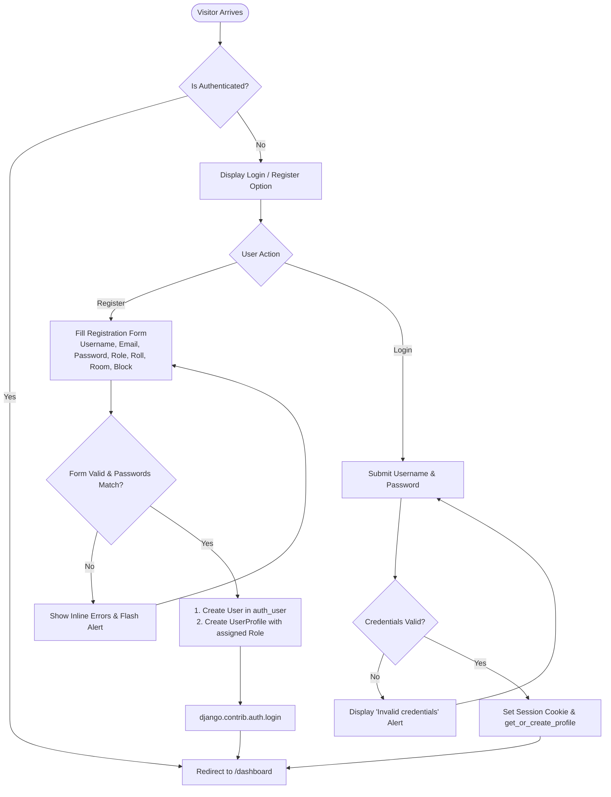

---

### 4.2 Dual Dashboard & Role Dispatch Flow

When any authenticated user visits `/`, the `dashboard` view inspects `profile.is_admin()`:

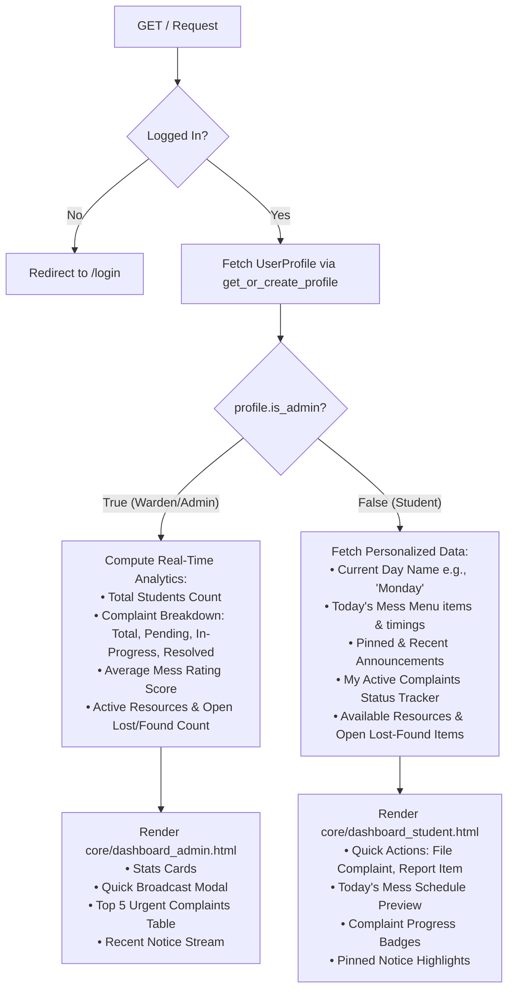

---

### 4.3 Complaint & Maintenance Ticket Lifecycle Flow

```mermaid
stateDiagram-v2
    [*] --> Submitted : Student fills ComplaintForm (Title, Category, Room, Priority, Description)
    
    Submitted --> Pending : Saved to DB (Default Status = 'pending')
    
    state "Warden Triage & Assignment" as Triage {
        Pending --> In_Progress : Warden marks 'In Progress' + adds technician remarks
        Pending --> Rejected : Warden rejects (e.g. Duplicate / Policy violation)
    }

    state "Work Execution" as Exec {
        In_Progress --> Resolved : Maintenance completed + Warden adds closure notes
        In_Progress --> Pending : Re-evaluated / Delayed
    }

    Rejected --> [*] : Student views rejection reason in complaint detail
    Resolved --> [*] : Ticket closed; Student confirms resolution
```

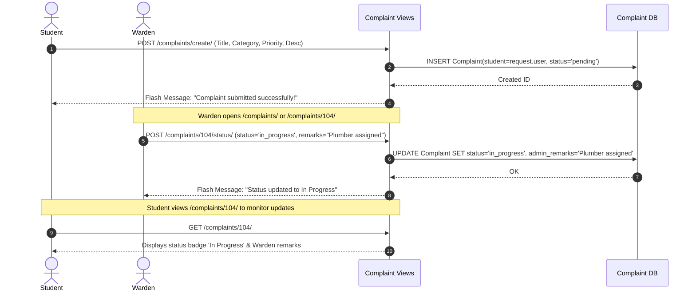

---

### 4.4 Mess Schedule & Food Quality Feedback Flow

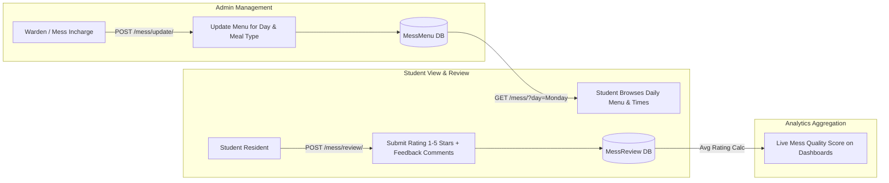

---

### 4.5 Peer Resource & Study Material Sharing Flow

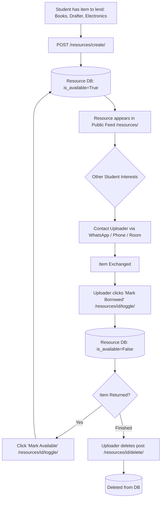

---

### 4.6 Lost & Found Incident Tracking Flow

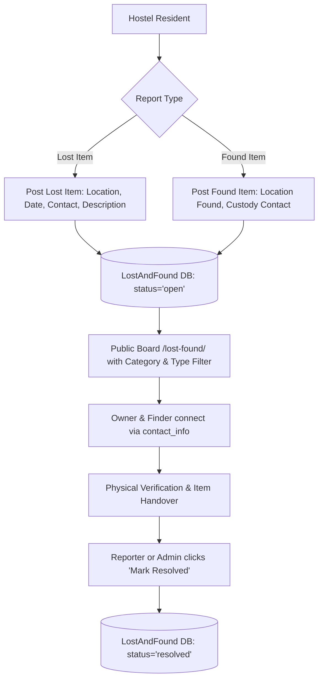

---

### 4.7 Admin Student & Room Roster Management Flow

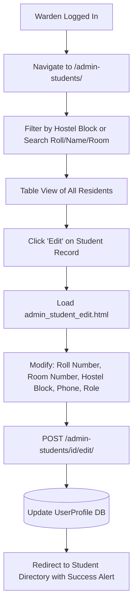

---

## 5. The Remaining Flows (Production & Enterprise Expansion Roadmap)

To transform HostelMate into a complete, enterprise-grade College Hostel Enterprise Resource Planning (ERP) platform, the following **8 critical remaining flows** are designed and specified below:

---

### 5.1 Flow A: Digital Outpass & Gate Pass Management System

#### The Need:
Currently, students leaving hostel premises for day outings, weekend trips, or emergency leaves write in paper registers with no parent verification or automated check-in/out gate logging.

#### The Complete Flow:
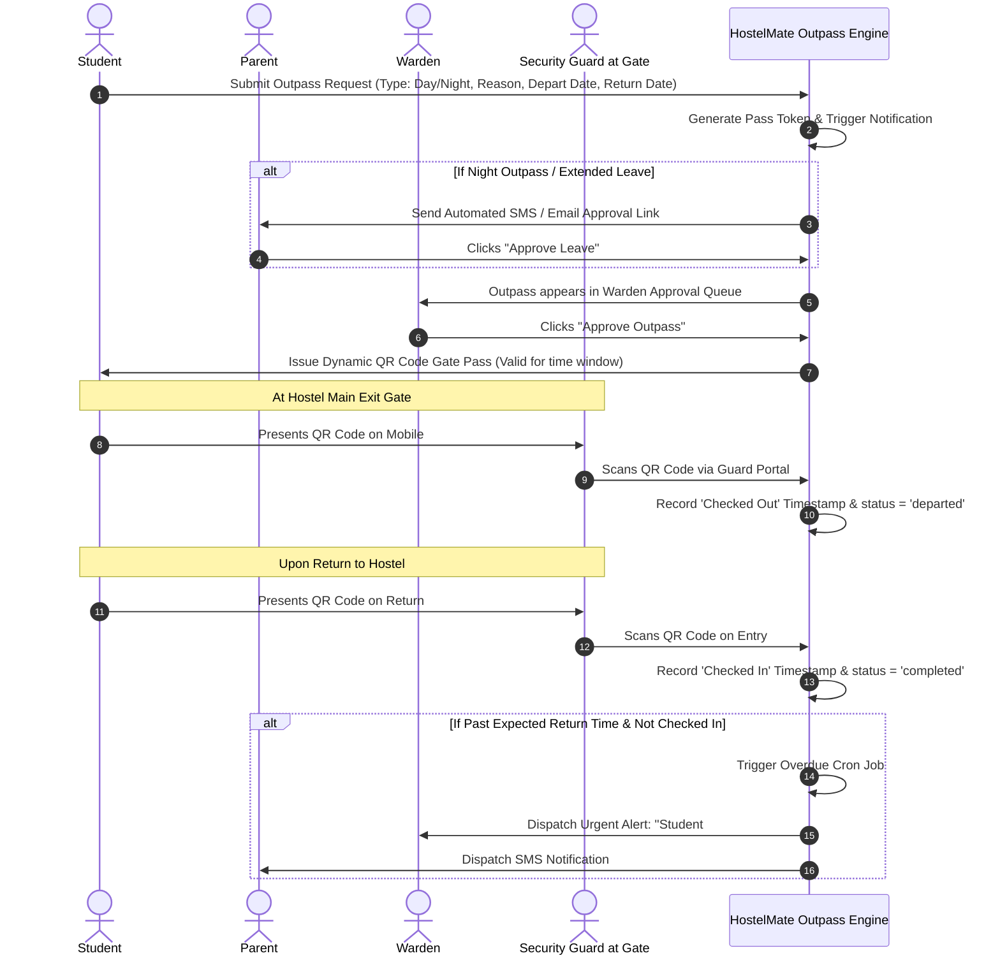

#### Database Additions Required:
- `OutpassRequest`: `student`, `outpass_type` (day/night/vacation), `destination`, `reason`, `depart_datetime`, `expected_return_datetime`, `actual_exit_datetime`, `actual_entry_datetime`, `status` (`pending_parent`, `pending_warden`, `approved`, `rejected`, `departed`, `completed`, `overdue`), `parent_approval_token`, `qr_hash_token`.

---

### 5.2 Flow B: Automated Room Allocation & Bed Matrix System

#### The Need:
Automating hostel admissions, floor/room capacity tracking, student room change requests, and end-of-semester "No-Dues" checkout clearance.

#### The Complete Flow:
```mermaid
flowchart TD
    subgraph 1. Room Inventory Setup
        Warden[Admin / Warden] --> CreateBlock[Create Blocks & Floors]
        CreateBlock --> DefineRooms[Define Rooms & Capacities: Single, Double, Triple Beds]
        DefineRooms --> BedMatrix[(Bed Inventory Matrix: Room 101 - Bed A, Bed B)]
    end

    subgraph 2. Semester Allotment
        StudentApply[New / Continuing Student Applies for Hostel] --> Preferences[Submit Block / Room Type Preferences]
        Preferences --> AllotmentEngine{Allocation Mode}
        AllotmentEngine -- Automatic --> MeritAuto[Auto-assign by Merit / Year / Branch]
        AllotmentEngine -- Manual --> WardenManual[Warden Manual Bed Allocation]
        MeritAuto & WardenManual --> AssignBed[Assign Bed & Update UserProfile.room_number]
    end

    subgraph 3. Room Swapping & Change
        Resident[Existing Resident] --> RequestSwap[Submit Room Swap Request with Peer]
        RequestSwap --> PeerApproval{Peer Accepts?}
        PeerApproval -- Yes --> WardenSwapApproval{Warden Approves?}
        WardenSwapApproval -- Yes --> ExecuteSwap[Atomic DB Swap of Room & Bed IDs]
    end

    subgraph 4. Vacation & No-Dues Clearance
        GraduatingStudent[Student Vacating Hostel] --> InitiateCheckout[Initiate Online Checkout]
        InitiateCheckout --> RoomInspection[Room Inspection: Furniture / Key Handover]
        RoomInspection --> ClearDues{Hostel & Mess Dues Cleared?}
        ClearDues -- Yes --> GenerateNoDues[Generate Digital No-Dues Certificate PDF]
        GenerateNoDues --> FreeBed[Mark Bed Matrix as 'Vacant' for New Admissions]
    end
```

#### Database Additions Required:
- `HostelBlock`: `name`, `gender_allowed`, `total_floors`, `caretaker_contact`.
- `Room`: `block_id`, `room_number`, `floor_number`, `room_type` (single, double, triple), `capacity`, `current_occupancy`, `is_maintenance_locked`.
- `Bed`: `room_id`, `bed_code` (e.g., '101-A'), `is_occupied`, `current_student_id`.
- `RoomChangeRequest`: `student_id`, `current_room_id`, `desired_room_id`, `target_student_id`, `reason`, `status`.

---

### 5.3 Flow C: Fee Ledger & Online Payment Gateway Flow

#### The Need:
Handling hostel seat rent, mess caution deposit, monthly mess dues, and damage penalty fees digitally with instant payment receipts.

#### The Complete Flow:
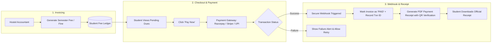

#### Database Additions Required:
- `FeeInvoice`: `student_id`, `fee_type` (semester_rent, mess_monthly, caution_deposit, penalty_fine), `amount`, `due_date`, `status` (`unpaid`, `paid`, `waived`, `partially_paid`).
- `PaymentTransaction`: `invoice_id`, `transaction_reference`, `gateway` (razorpay/stripe), `amount_paid`, `payment_method`, `timestamp`, `receipt_pdf_path`.

---

### 5.4 Flow D: Real-Time Notification & Emergency Broadcast Engine

#### The Need:
Instantaneous mobile push notifications, WebSockets, and SMS alerts for emergency notices (fire drill, power outage, water cutoff) and complaint status updates.

#### The Complete Flow:
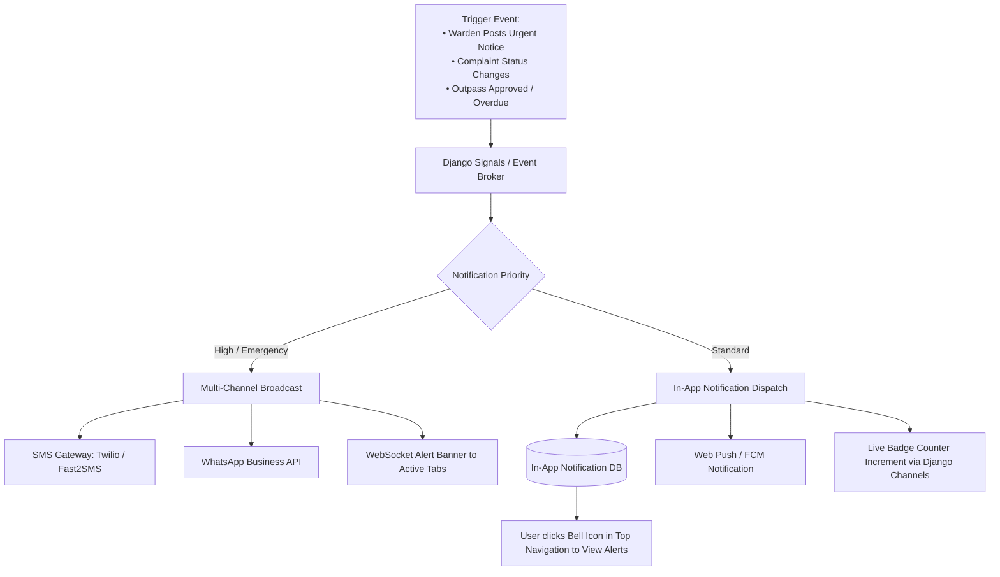

---

### 5.5 Flow E: Resident Night Roll-Call & Attendance Tracking Flow

#### The Need:
Night curfew enforcement (e.g., 9:30 PM roll call) without tedious paperwork.

#### The Complete Flow:
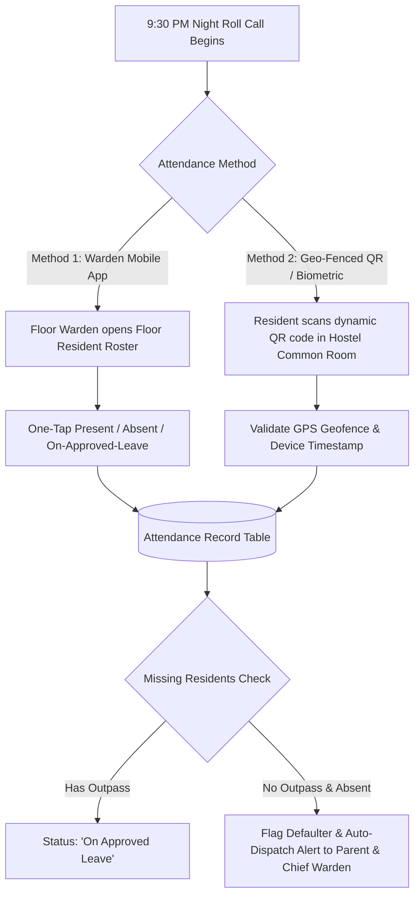

---

### 5.6 Flow F: Maintenance Staff / Technician Work Order Dispatch Flow

#### The Need:
Connecting filed complaints directly to hostel maintenance staff (electricians, plumbers, carpenters) with Service Level Agreement (SLA) countdowns and student completion OTPs.

#### The Complete Flow:
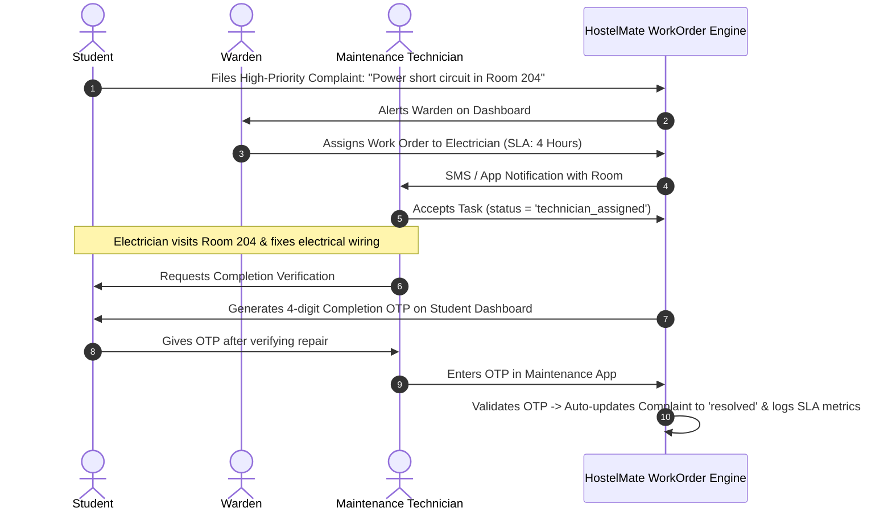

---

### 5.7 Flow G: Visitor & Guest Room Reservation Flow

#### The Need:
Managing parents and guests visiting residents, temporary guest room bookings, and visitor entry passes.

#### The Complete Flow:
```mermaid
flowchart LR
    VisitorArrives[Parent / Visitor Arrives at Hostel Gate] --> CheckRecord{Pre-Registered by Student?}
    
    CheckRecord -- Yes --> VerifyCode[Guard inputs Student Pre-Approval Pass Code]
    CheckRecord -- No --> OnSpotReg[Guard logs Visitor Name, Photo, Govt ID, Resident Visited]
    
    VerifyCode & OnSpotReg --> PrintPass[Generate Temporary Visitor Badge with Expiry Time]
    PrintPass --> NotifyResident[SMS/Notification to Resident: 'Your visitor has entered']
    
    subgraph Guest Room Stay (Optional)
        ResidentApplies[Student applies for Parent Guest Room 2-day stay] --> AdminApproval{Warden Approves?}
        AdminApproval -- Yes --> GuestRoomBooking[(Guest Room Reserved + Fee Added to Ledger)]
    end
```

---

### 5.8 Flow H: Automated Reporting & SLA Analytics Flow

#### The Need:
Providing hostel directors, chief wardens, and university management with weekly/monthly performance audits.

#### The Complete Flow:
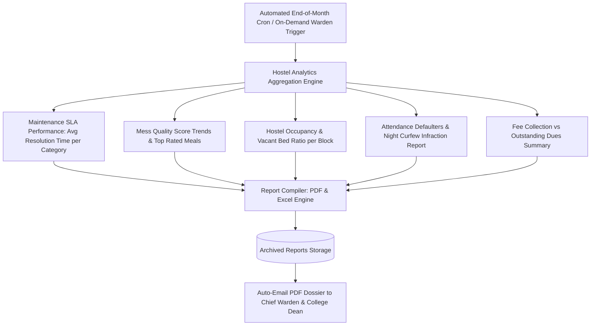

---

## 6. API Endpoints Specification

Below is the complete REST / View Endpoint Matrix for both current routes and roadmap extensions:

### Implemented Endpoints
| HTTP Method | Route URL | View Handler | Access Level | Description |
| :--- | :--- | :--- | :--- | :--- |
| `GET` | `/` | `views.dashboard` | Authenticated | Renders Student or Warden Dashboard depending on user role |
| `GET`, `POST` | `/register/` | `views.register_view` | Anonymous | User registration and profile creation |
| `GET`, `POST` | `/login/` | `views.login_view` | Anonymous | Session authentication |
| `GET`, `POST` | `/logout/` | `views.logout_view` | Authenticated | Clears session and logs out |
| `GET`, `POST` | `/profile/` | `views.profile_view` | Authenticated | View and edit personal contact & room details |
| `GET` | `/announcements/` | `views.announcements_list` | Authenticated | View, search, and category-filter notice board |
| `POST` | `/announcements/create/` | `views.announcement_create`| Warden Only | Broadcast a new announcement |
| `POST` | `/announcements/delete/<id>/` | `views.announcement_delete`| Warden Only | Delete an existing announcement |
| `GET` | `/complaints/` | `views.complaints_list` | Authenticated | View list of complaints (Self for students, all for warden) |
| `POST` | `/complaints/create/` | `views.complaint_create` | Authenticated | Submit a new maintenance ticket |
| `GET` | `/complaints/<id>/` | `views.complaint_detail` | Owner / Warden | View complaint lifecycle details and remarks |
| `POST` | `/complaints/<id>/status/` | `views.complaint_update_status`| Warden Only | Update complaint status and add admin remarks |
| `GET` | `/mess/` | `views.mess_menu_view` | Authenticated | View day-wise mess schedule & average reviews |
| `POST` | `/mess/update/` | `views.mess_menu_update` | Warden Only | Create or update menu item for specific day & meal |
| `POST` | `/mess/review/` | `views.mess_review_create` | Authenticated | Submit star rating (1-5) and dining review |
| `GET` | `/resources/` | `views.resources_list` | Authenticated | Browse shared student equipment, notes, books |
| `POST` | `/resources/create/` | `views.resource_create` | Authenticated | Share a new resource listing |
| `POST` | `/resources/<id>/toggle/` | `views.resource_toggle_status` | Owner / Warden | Toggle resource availability state |
| `POST` | `/resources/<id>/delete/` | `views.resource_delete` | Owner / Warden | Remove shared resource listing |
| `GET` | `/lost-found/` | `views.lost_found_list` | Authenticated | Search & filter lost and found directory |
| `POST` | `/lost-found/create/` | `views.lost_found_create` | Authenticated | Report a lost or found item |
| `POST` | `/lost-found/<id>/toggle/`| `views.lost_found_toggle_status`| Owner / Warden | Toggle item status (open vs resolved) |
| `POST` | `/lost-found/<id>/delete/`| `views.lost_found_delete`| Owner / Warden | Delete lost and found report |
| `GET` | `/admin-students/` | `views.admin_students_list` | Warden Only | View and search all registered residents |
| `GET`, `POST` | `/admin-students/<id>/edit/`| `views.admin_student_edit` | Warden Only | Edit student block, room, contact, and role |

---

### Roadmap API Endpoints (For Mobile App & Extensions)
| HTTP Method | Proposed Route URL | Module | Purpose |
| :--- | :--- | :--- | :--- |
| `GET`, `POST` | `/api/v1/outpass/` | Outpass Engine | List active outpasses / Apply for new digital gate pass |
| `POST` | `/api/v1/outpass/<id>/approve/`| Outpass Engine | Warden or parent one-click outpass approval |
| `POST` | `/api/v1/outpass/scan/` | Outpass Engine | Guard QR code scan at hostel gate (Entry/Exit) |
| `GET` | `/api/v1/rooms/matrix/` | Bed Matrix | Fetch real-time visual bed availability map |
| `POST` | `/api/v1/rooms/swap-request/` | Bed Matrix | Submit peer room change request |
| `GET` | `/api/v1/fees/invoices/` | Fee Ledger | Fetch student invoice and balance summary |
| `POST` | `/api/v1/fees/pay/` | Fee Ledger | Initialize Razorpay / Stripe payment session |
| `POST` | `/api/v1/fees/webhook/` | Fee Ledger | Webhook receiver for instant payment confirmation |
| `POST` | `/api/v1/attendance/mark/` | Attendance | Mobile geo-fenced night roll call check-in |
| `POST` | `/api/v1/complaints/<id>/otp-verify/`| Technician Engine | Verify technician completion via 4-digit student OTP |
| `GET` | `/api/v1/analytics/export-pdf/`| Reports Engine | Download monthly hostel audit report in PDF format |

---

## 7. Security, Scalability & Production Deployment Architecture

### 7.1 Security Architecture
1. **Authentication & Session Protection:**
   - Django secure session cookies (`HttpOnly`, `SameSite='Lax'`, `Secure` in production).
   - Passwords hashed using industry standard PBKDF2 with SHA-256 (or Argon2).
2. **CSRF & Injection Defense:**
   - Mandatory CSRF tokens on all state-changing `POST` requests.
   - 100% Parameterized queries via Django ORM preventing SQL Injection.
   - Auto-escaped template rendering preventing Cross-Site Scripting (XSS).
3. **Role Validation Enforcement:**
   - Server-side role validation in all admin views (never trusting client parameters).
   - Ownership checks on edit/delete operations (`resource.uploader == request.user or profile.is_admin()`).

---

### 7.2 Scalable Production Deployment Topology

```
                                  [ Internet Traffic / HTTPS ]
                                                │
                                                ▼
                         ┌─────────────────────────────────────────────┐
                         │              CLOUDFLARE / CDN               │
                         │    • DDoS Shield   • SSL Termination        │
                         │    • Static Asset Caching (CSS/JS/Media)    │
                         └──────────────────────┬──────────────────────┘
                                                │
                                                ▼
                         ┌─────────────────────────────────────────────┐
                         │           NGINX REVERSE PROXY               │
                         │    • Port 80/443 Routing                    │
                         │    • Rate Limiting & Gzip Compression       │
                         │    • Serves `/static/` and `/media/`        │
                         └──────────────────────┬──────────────────────┘
                                                │ UNIX Socket / Proxy Pass
                                                ▼
                         ┌─────────────────────────────────────────────┐
                         │        GUNICORN / UVICORN WSGI/ASGI         │
                         │    • 4 - 8 Django Worker Processes          │
                         │    • Django Application Runtime (HostelMate)│
                         └──────────────┬──────────────┬───────────────┘
                                        │              │
                   ┌────────────────────┘              └────────────────────┐
                   ▼                                                        ▼
┌──────────────────────────────────────┐                ┌──────────────────────────────────────┐
│        POSTGRESQL DATABASE           │                │             REDIS CACHE              │
│   • Relational ACID Data             │                │   • Session Storage                  │
│   • Connection Pooling (PgBouncer)   │                │   • Mess Menu & Dash Query Cache     │
│   • Automated Daily Snapshots        │                │   • Celery Asynchronous Job Broker   │
└──────────────────────────────────────┘                └──────────────────────────────────────┘
```

---

## 8. Summary & Next Steps

This document represents the complete system architectural blueprint for **HostelMate**. 

### Recommended Action Plan:
1. **Phase 1 (Current Core):** Maintain and refine the existing 7 modules (Auth, Dashboards, Announcements, Complaints, Mess, Resources, Lost & Found).
2. **Phase 2 (Immediate Extension):** Implement **Flow A (Digital Outpass System)** and **Flow D (Real-time In-App Notifications)** as they provide the highest immediate operational value for campus security.
3. **Phase 3 (Enterprise Readiness):** Implement **Flow B (Room Allocation & Bed Matrix)**, **Flow C (Online Fee Payments)**, and **Flow F (Technician Work Orders with OTP Verification)**.

---
*End of Architectural Specification — HostelMate System Blueprint.*
